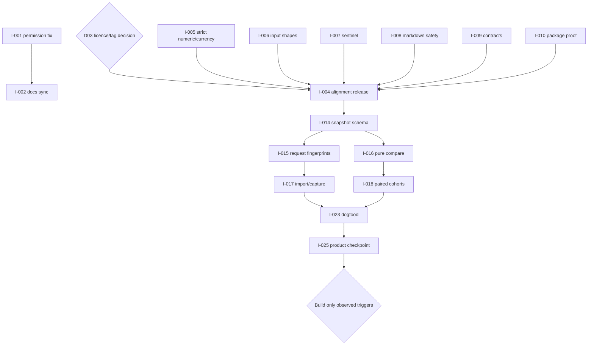

# Acceleration roadmap

This is a **decision-conditioned roadmap**, not permission to implement every item. Selection order is:

1. current live failures and issue #20;
2. confirmed M0 decisions and trust fixes;
3. evidence-integrity architecture;
4. one measured real consumer;
5. trigger-gated horizon work only.

The in-repo agent should select the smallest coherent slice with a named proving check and preserve the repository's existing `NEXT.md` demand discipline.

## M0 — Trust alignment / v0.1.3 candidate

Close known development-policy risk, fix verdict-integrity edge cases, align licence/version/release identity and raise packaging assurance.

**Exit:** Selected release strategy is recorded; all P0/P1 M0 issues pass exact-head verification.

| ID | Pri | Owner | Task | Depends on |
|---|---|---|---|---|
| I-001 | P0 | agent | Fix Claude permission rules and close #20 | — |
| I-002 | P0 | agent | Synchronize harness/runtime documentation | I-001 |
| I-003 | P0 | human+agent | Record the licence and floating-tag transition decision | — |
| I-004 | P0 | human+agent | Prepare and publish the selected alignment release | I-001, I-002, I-003, I-005, I-007, I-008, I-009, I-010 |
| I-005 | P1 | agent | Reject non-finite, negative and non-USD pricing inputs | — |
| I-006 | P1 | agent | Validate nested input shapes and policy keys | — |
| I-007 | P1 | agent | Fix field_match missing-value sentinel collision | — |
| I-008 | P1 | agent | Escape dynamic Markdown and suppress accidental mentions | — |
| I-009 | P1 | agent | Enforce scorer and provider result contracts | — |
| I-010 | P1 | agent | Build and install-test wheel/sdist and verify licence contents | — |
| I-011 | P2 | agent | Add Windows smoke and action/shell static checks | — |
| I-012 | P2 | agent | Pin upstream Actions and declare least privileges | — |
| I-013 | P1 | agent | Publish an Action security and data-handling guide | I-008 |
## M1 — Evidence integrity / v0.2 candidate

Make evidence first-class, request-bound, importable and deterministically comparable.

**Exit:** Current examples run through snapshots; stale evidence is rejected; paired/coverage semantics are documented and tested.

| ID | Pri | Owner | Task | Depends on |
|---|---|---|---|---|
| I-014 | P1 | agent | Define immutable run-snapshot schema v1 | I-006, I-009 |
| I-015 | P1 | agent | Add request fingerprints and fixture v2 migration | I-014 |
| I-016 | P1 | agent | Add pure snapshot comparison command | I-014 |
| I-017 | P1 | agent | Add import/capture workflow | I-014, I-016 |
| I-018 | P1 | agent | Implement paired comparison and coverage guardrails | I-014 |
| I-019 | P1 | agent | Version report/manifest schemas and publish migration notes | I-014, I-015, I-018 |
| I-020 | P2 | agent | Publish JSON Schemas and add validate | I-006, I-014 |
| I-021 | P1 | human+agent | Implement disclosure/redaction profiles | I-014, I-019 |
| I-022 | P2 | agent | Add atomic output writes and deterministic size limits | I-021 |
## M2 — First real consumer

Validate the product boundary in a real owned application and make onboarding repeatable.

**Exit:** A deliberate regression is blocked in a real app; setup friction and follow-up decisions are recorded.

| ID | Pri | Owner | Task | Depends on |
|---|---|---|---|---|
| I-023 | P1 | human+agent | Dogfood one real application repository | I-013, I-016, I-017 |
| I-024 | P2 | agent | Ship a conservative init scaffold and reference workflow | I-020, I-023 |
| I-025 | P1 | human+agent | Hold a measured post-dogfood product checkpoint | I-023, I-024 |
## M3 — Triggered horizon

Only build concurrency, importers, statistics, plugins, history or hosting when NEXT.md evidence thresholds are met.

**Exit:** Per-feature triggers, not calendar dates.

| ID | Pri | Owner | Task | Depends on |
|---|---|---|---|---|
| I-026 | P3 | agent | Add bounded execution concurrency, retries and resume | I-014, I-025 |
| I-027 | P3 | agent | Add evidence-format importers on demand | I-014, I-025 |
| I-028 | P3 | human+agent | Add repeated trials and confidence-aware policy | I-018, I-025 |
| I-029 | P3 | agent | Add entry-point plugins after the second external extension | I-009, I-025 |
| I-030 | P3 | human+agent | Add signing, attestations or zipapp only for a trust/distribution need | I-010, I-025 |
| I-031 | P3 | human+agent | Add local history/trends only after repeated team demand | I-019, I-025 |
| I-032 | P3 | human+agent | Add an LLM judge only after deterministic scorers fail twice | I-014, I-025 |
| I-033 | P3 | human+agent | Revisit hosted UI only after result-history demand | I-031 |

## Recommended critical path

## Scope-control rule

M3 items are **not backlog promises**. An agent may enrich their design notes, but must not implement them unless a live `NEXT.md` trigger is recorded with evidence and any human/privacy/hosting gate is resolved.
