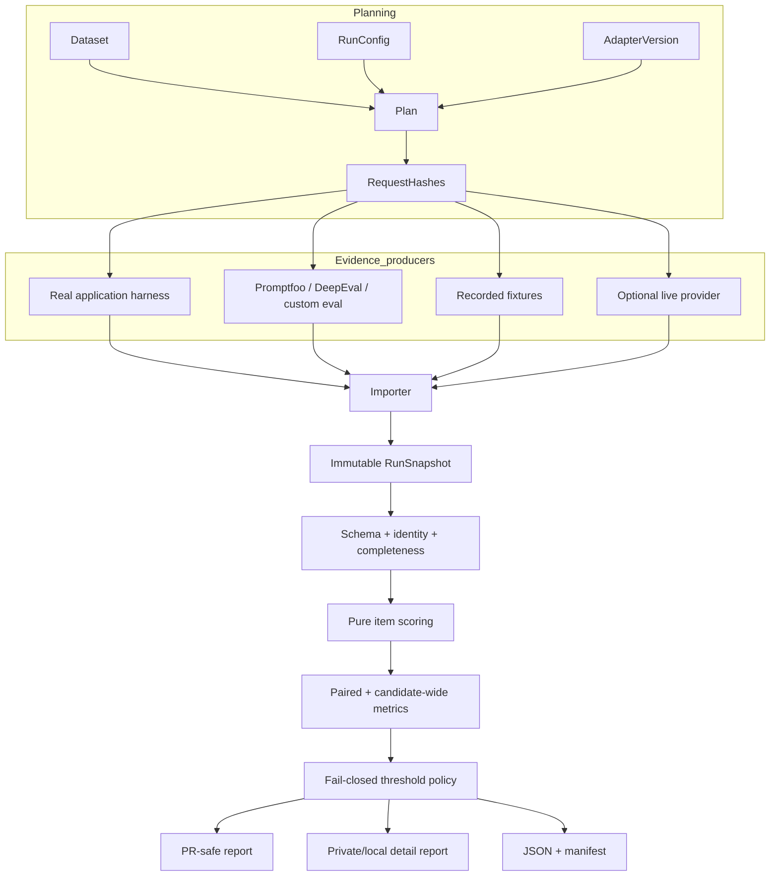

# Recommended target architecture: evidence-first release gating

## Core decision

Separate **execution evidence production** from **deterministic policy comparison**.



## Suggested module layout

```text
src/llm_release_gate/
  planning.py             # render requests and hashes
  snapshots/
    model.py              # dataclasses/typed dictionaries
    loading.py            # strict schema and identity validation
    canonical.py          # stable snapshot hash
    migration.py          # fixture v1 -> fixture/snapshot v2
  importers/
    native_jsonl.py       # canonical generic import
  comparison/
    cohorts.py            # common item populations and coverage
    metrics.py            # pure aggregation over snapshots
    policy.py             # existing gate semantics, evolved
  disclosure/
    profiles.py           # local/private/public policy
    redaction.py
  reports/
    ...
  execution/              # optional, not required by comparator
    replay.py
    provider_protocol.py
```

The existing public modules can be retained and internally delegate during migration.

## EvaluationPlan identity

A request fingerprint should include semantic request inputs, not paths or timestamps:

```json
{
  "schema_version": "1",
  "dataset_sha256": "sha256:...",
  "config_sha256": "sha256:...",
  "adapter": {"name": "rag", "version": "2"},
  "item_id": "refund-policy-1",
  "request": {
    "model": "model-name-or-app-target",
    "system": "...",
    "prompt": "...",
    "params": {"temperature": 0}
  }
}
```

Canonical hash:

```text
sha256(canonical_json(plan_item_without_hash))
```

Whether `config_sha256` is included in the request hash is a compatibility decision. A strong default is:

- request hash: exact semantic request;
- plan/config hash: higher-level identity;
- snapshot requires both.

This distinguishes a harmless metadata/name change from a real request change while still pinning the declared configuration.

## RunSnapshot model

A snapshot needs to represent success, provider/application failure and unavailable measurements without guessing.

```json
{
  "schema_version": "1",
  "snapshot_id": "sha256:...",
  "plan_sha256": "sha256:...",
  "dataset_sha256": "sha256:...",
  "config_sha256": "sha256:...",
  "adapter": {"name": "rag", "version": "2"},
  "execution": {
    "mode": "imported",
    "executor": {"name": "extract-api-eval", "version": "git:abc123"},
    "provenance": {"source": "ci", "run_id": "optional"}
  },
  "items": [
    {
      "item_id": "refund-policy-1",
      "request_sha256": "sha256:...",
      "status": "ok",
      "output": {"text": "..."},
      "usage": {"prompt_tokens": 120, "completion_tokens": 31},
      "latency_ms": 440.1
    }
  ]
}
```

A volatile capture manifest may hold timestamps, machine paths and CI URLs outside `snapshot_id`.

## Comparison populations

For every metric, report:

- `candidate_all`: all candidate-applicable items;
- `baseline_all`: all baseline-applicable items;
- `paired`: items for which both sides have valid comparable values;
- `coverage`: paired count / expected applicable count.

Policy examples:

```json
{
  "metric": "quality.pass_rate",
  "scope": "paired",
  "max_drop_abs": 0.02,
  "min_n": 50,
  "min_coverage": 0.95
}
```

Absolute safety floor:

```json
{
  "metric": "quality.pass_rate",
  "scope": "candidate_all",
  "min_value": 0.90,
  "min_coverage": 0.99
}
```

## Disclosure profiles

### `public-pr`

- no raw outputs;
- sanitized rule/metric labels;
- no absolute local paths;
- provider errors reduced to stable classes/codes;
- bounded failing-item IDs;
- no automatic mentions;
- detailed artifact link only when uploaded under an approved retention policy.

### `private-ci`

- failing outputs allowed under deterministic truncation;
- no secrets or selected field paths;
- full hashes and item IDs;
- provider errors redacted.

### `local`

- full outputs and diagnostics;
- still no credentials;
- optional absolute manifest paths;
- no upload implied.

## Compatibility plan

1. v0.1.x: harden current inputs and report schema 1.
2. v0.2.0: introduce plan/snapshot schemas and `compare`; keep `gate` compatibility wrapper.
3. fixture v1:
   - may be converted to snapshot v1 only as `provenance: legacy-unbound`;
   - must not produce a normal trusted verdict unless the owner explicitly permits legacy mode;
   - migration must never invent request hashes.
4. Future schema versions:
   - readers reject unknown major schema versions;
   - additive optional fields may remain compatible;
   - result-hash semantic changes require release notes and golden tests.
